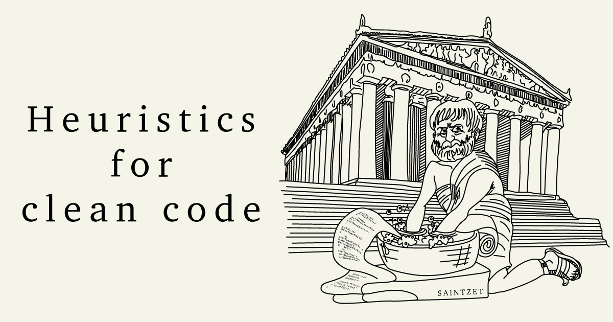

 

## :exclamation: *All heuristic rules in [GitHub Wiki](https://github.com/SaintZet/HeuristicsForClearCode/wiki)* :exclamation:

### :bulb: Usage

The purpose of this knowledge library is to **structure** and **quickly access** various "[code smell](https://en.wikipedia.org/wiki/Code_smell)" and methods of dealing with them. 
 
Idea of creating this repository came to me while reading Robert Martin's "*Clean Code*". I realized that I would like to have all these rules at my fingertips in a convenient format. 
I've shortened the information a bit so that it can be referred to as a hint and referenced without using a different context. 
 
One of the advantages of this project is the ability to copy links to specific rules or code smells. 
You can use thise links in private correspondence with colleagues, in comments on pull requests, in forums, or anywhere else. 
For example in your amazing readme file without [too much information](https://github.com/SaintZet/HeuristicsForCleanCode/wiki/%5BG%5Deneral#g08-too-much-information) :smile:  
 
Most of the rules are illustrated with code examples. You can view the code without rules, each file is signed with the name of the rule and contain comments. 
To the extent possible, these rules will be further supported by code examples. And perhaps personal observations. 
 
I hope this project will be useful for you and I invite you to participate in discussions, create issues and contribute your examples.

### :information_source: Acknowledgment

The inspiration for writing these heuristics in a wiki format was Robert C. Martin "*Clean Code*". In turn, Robert Martin refers to other works: 
- Refactoring: Improving the Design of Existing Code, Martin Fowler et al., Addison-Wesley, 1999.
- The Pragmatic Programmer, Andrew Hunt, Dave Thomas, Addison-Wesley, 2000.
- Design Patterns: Elements of Reusable Object-Oriented Software, Gamma et al., Addison-Wesley, 1996.
- Smalltalk Best Practice Patterns, Kent Beck, Prentice Hall, 1997. 
- Implementation Patterns, Kent Beck, Addison-Wesley, 2008.
- Agile Software Development: Principles, Patterns, and Practices, Robert C. Martin, Prentice Hall, 2002.
- Domain Driven Design, Eric Evans, Addison-Wesley, 2003. 

I am immensely grateful to these people for their work. 

### :warning: Important

Clean code is not written by following a set of rules. You don’t become a software craftsman by learning a list of heuristics. Professionalism and craftsmanship come from values that drive disciplines.

 

  
<h2>Перевод </h2>

### :exclamation: *All heuristic rules on [GitHub Wiki](https://github.com/SaintZet/HeuristicsForClearCode/wiki)* :exclamation:

### :bulb: Применение

Целью данной библиотеки знаний является **структурированный** и **быстрый доступ** к различным "[запахам кода](https://ru.wikipedia.org/wiki/Код_с_запашком)" и методов борьбы с ними.  
 
Идея создания этого репозитория пришла мне, когда я читал "*Чистый код*" Роберта Мартина. Я понял, что хотел бы иметь все эти правила под рукой в удобном формате. 
Я немного ужал информацию для того, что бы к ней можно было обратиться как к подсказке и ссылаться на нее не используя другой контекст. 
 
Одним из преимуществ этого проекта является возможность копирования ссылок на определенные правила или запахи кода. 
Вы можете использовать эти ссылки в личной переписке с коллегами, в комментариях к пулл-реквестам, на форумах или где-либо еще. 
Например, в вашем прекрасном файле readme без [лишней информации](https://github.com/SaintZet/HeuristicsForCleanCode/wiki/%5BG%5Deneral#g08-too-much-information) :smile: 
 
Большая часть правил проиллюстрированы примерами кода. Вы можете просматривать код и без правил, каждый файл подписан именем правила и содержит комментарии. 
По мере возможности, данные правила будут еще больше подкрепляться примерами кода. И возможно, личными наблюдениями.  
 
Я надеюсь вам этот проект пригодиться и приглашаю участвовать в обсуждениях, создании issues и контребьютить свои примеры. 

### :information_source: Благодарность

Вдохновением для написания этих эвристических правил в виде вики послужила книга Роберта Мартина "*Чистый код*". В свою очередь Роберт Мартин ссылается на другие не менее значимые труды:
- Refactoring: Improving the Design of Existing Code, Martin Fowler et al., Addison-Wesley, 1999.
- The Pragmatic Programmer, Andrew Hunt, Dave Thomas, Addison-Wesley, 2000.
- Design Patterns: Elements of Reusable Object Oriented Software, Gamma et al., Addison-Wesley, 1996.
- Smalltalk Best Practice Patterns, Kent Beck, Prentice Hall, 1997.
- Implementation Patterns, Kent Beck, Addison-Wesley, 2008.
- Agile Software Development: Principles, Patterns, and Practices, Robert C. Martin, Prentice Hall, 2002.
- Domain Driven Design, Eric Evans, Addison-Wesley, 2003. 

Я безмерно благодарен этим людям за их работу. 

### :warning: Важно

Невозможно написать чистый код, действуя по списку правил. Нельзя стать мастером, изучив набор эвристик. Профессионализм и мастерство формируются на основе ценностей, которыми вы руководствуетесь в обучении.

 
  
<h2>Переклад </h2>

### :exclamation: *Всі евристичні правила в [GitHub Wiki](https://github.com/SaintZet/HeuristicsForClearCode/wiki)* :exclamation:

### :bulb: Застосування

Метою даної бібліотеки знань є **структурований** та **швидкий доступ** до різних "[запахів коду](https://uk.wikipedia.org/wiki/Запахи_коду)" та методів бородьби з ними.  
 
Ідея створення цього репозиторію прийшла до мене, коли я читав "*Чистий код*" Роберта Мартина. Я зрозумів, що хотів би мати всі ці правила під рукою в зручному форматі. 
Я трохи зтиснув інформацію для того, щоб до неї можна було звернутися як до підказки та посилатися на неї не використовуючи інший контекст. 
 
Однією з переваг цього проекту є можливість копіювати посилання на конкретні правила або запахи коду. 
Ви можете використовувати ці посилання в приватному листуванні з колегами, в коментарях до запитів на отримання, на форумах або де завгодно. 
Наприклад, у вашому дивовижному файлі readme без [зайвої інформації](https://github.com/SaintZet/HeuristicsForCleanCode/wiki/%5BG%5Deneral#g08-too-much-information) 
 
Більшість правил проілюстровані прикладами коду. Ви можете переглядати код без правил, кожен файл підписаний ім'ям правила і містить коментарі. 
У міру можливості дані правила будуть ще більше підкріплюватися прикладами коду. І можливо, особистими спостереженнями.  
 
Я сподіваюся вам цей проект статане в нагоді також запрошую брати участь в обговореннях, створенні issues та контреб'ютити свої приклади.

### :information_source: Подяка

Натхненням для написання цих евристичних правил у вигляді вікі послужила книга Роберта Мартіна "*Чистий код*". У свою чергу Роберт Мартін посилається на інші не менш важливі праці:
- Refactoring: Improving the Design of Existing Code, Martin Fowler et al., Addison-Wesley, 1999.
- The Pragmatic Programmer, Andrew Hunt, Dave Thomas, Addison-Wesley, 2000.
- Design Patterns: Elements of Reusable Object Oriented Software, Gamma et al., Addison-Wesley, 1996.
- Smalltalk Best Practice Patterns, Kent Beck, Prentice Hall, 1997.
- Implementation Patterns, Kent Beck, Addison-Wesley, 2008.
- Agile Software Development: Principles, Patterns, and Practices, Robert C. Martin, Prentice Hall, 2002.
- Domain Driven Design, Eric Evans, Addison-Wesley, 2003. 

Я безмежно вдячний цим людям за їх працю. 

### :warning: Важливо

Неможливо написати чистий код, діючи за списком правил. Не можна стати майстром, вивчивши набір евристик. Професіоналізм та майстерність формуються на основі цінностей, якими ви керуєтеся у навчанні.

